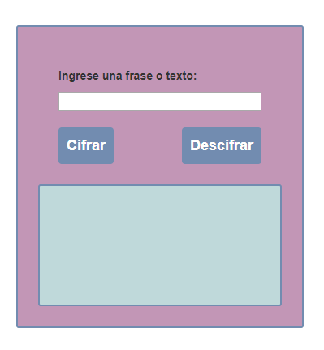

## README
1. **Descripcion del proyecto:**
  - Este proyecto contiene una página que pide una frase al usuario y devuelve el mismo mensaje encriptado según el algoritmo de Cifrado César con el parámetro de desplazamiento de 33 espacios hacia la derecha usando los cambios de javascript es6.
  - De igual forma tambien desencriptar textos.

2. **Autor:**

  - Lilliam Haro (warrior-code)

2. **Herramientas utilizadas:**

  - HTML5
  - CSS3
  - Javascript ES6

 
